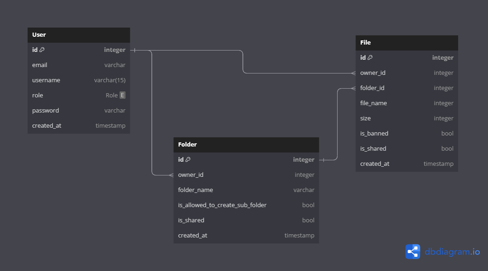

<h1 align="center"> Propacity Backend Assignment</h1>
<p align="center">
<a href="https://github.com/Ryuk-me"></a>
</p>
<p align="center">
<a href="https://github.com/Ryuk-me"></a>
<a href="https://github.com/Ryuk-me/pocket-url/stargazers/"></a>
<a href="https://github.com/Ryuk-me/pocket-url/network/members"></a>
<a href="https://github.com/Ryuk-me/pocket-url/issues">

> ## Techstack

- [Techstack](./docs/techstack.md)

## Database Schema

> https://dbdiagram.io/d/64c7e3c502bd1c4a5eff3af9



> ## Installation

```sh

# Install pnpm
$ npm i -g pnpm

# Install Dependencies
$ pnpm install

> Rename .env.example to .env

# Migrate Using Prisma
$ pnpm prisma migrate dev --name init

# Start Server
$ pnpm run start

# Access
$ http://localhost:${PORT}/health

# Using Docker
$ docker-compose build

# Start
$ docker-compose --env-file ./.env.docker up

# Access
$ http://localhost:${PORT}/health

```

> GET [/health](https://api-propacity-ryuk-me.cloud.okteto.net/health)

<details open>
<summary> See response</summary>
<p>

```json
{
	"app": "propacity-task",
	"request_ip": "::ffff:10.8.26.10",
	"uptime": 1603.502325168,
	"hrtime": [3081390, 76960985],
	"database": "connected",
	"mode": "production"
}
```

</p>
</details>

> GET [/api/v1/user/me](https://api-propacity-ryuk-me.cloud.okteto.net/api/v1/user/me)

<details open>
<summary> See response</summary>
<p>

```json
Headers : Bearer eyJhbGciO.......

{
    "id": 1,
    "email": "ryuk@gmail.com",
    "username": "dexter",
    "role": "USER",
    "created_at": "2023-07-31T12:45:57.182Z"
}

{
  "message": "Could not validate credentials"
}
```

</p>
</details>

> POST [/api/v1/user](https://api-propacity-ryuk-me.cloud.okteto.net/api/v1/user/me)

<details open>
<summary> See response</summary>
<p>

```json
JSON BODY

{
  "email" : "ryuk@gmail.com",
  "username" : "dexter",
  "role" : "USER",
  "password" : "123"
}

{
    "message": "A user already exist with this email."
}
```

</p>
</details>


## Test Api Endpoints

> Import given postman collection [v2.1] to Postman and test predefined endpoints.

#### License

MIT © [Neeraj Kumar](https://github.com/ryuk-me)
