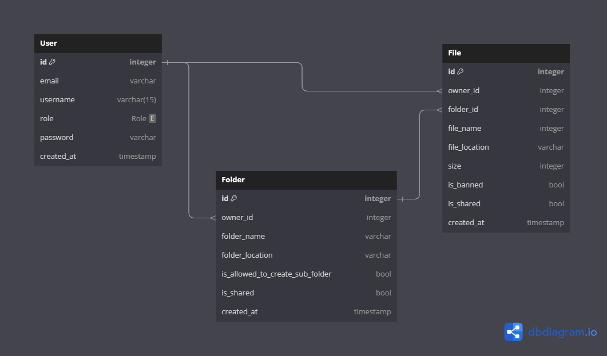

<h1 align="center"> Propacity Backend Assignment</h1>
<p align="center">
<a href="https://github.com/Ryuk-me"></a>
</p>
<p align="center">
<a href="https://github.com/Ryuk-me"></a>
<a href="https://github.com/Ryuk-me/pocket-url/stargazers/"></a>
<a href="https://github.com/Ryuk-me/pocket-url/network/members"></a>
<a href="https://github.com/Ryuk-me/pocket-url/issues">

> ## Techstack

- [Techstack](./docs/techstack.md)

## Database Schema

> https://dbdiagram.io/d/64c7e3c502bd1c4a5eff3af9



> ## Installation

```sh

# Install pnpm
$ npm i -g pnpm

# Install Dependencies
$ pnpm install

> Rename .env.example to .env

# Migrate Using Prisma
$ pnpm prisma migrate dev --name init

# Start Server
$ pnpm run start

# Access
$ http://localhost:${PORT}/health

# Using Docker
$ docker-compose build

# Start
$ docker-compose --env-file ./.env.docker up

# Access
$ http://localhost:${PORT}/health

```

> [GET] Health Endpoint [/health](https://api-propacity-ryuk-me.cloud.okteto.net/health)

<details open>
<summary> See response</summary>
<p>

```json
RESPONSE 200
{
	"app": "propacity-task",
	"request_ip": "::ffff:10.8.26.10",
	"uptime": 1603.502325168,
	"hrtime": [3081390, 76960985],
	"database": "connected",
	"mode": "production"
}
```

</p>
</details>

> [POST] Create User [/api/v1/user](https://api-propacity-ryuk-me.cloud.okteto.net/api/v1/user)

<details open>
<summary> See response</summary>
<p>

```json
JSON BODY

{
  "email" : "ryuk@gmail.com",
  "username" : "dexter",
  "role" : "USER",
  "password" : "123"
}

RESPONSE 201

{
    "id": 1,
    "email": "ryuk@gmail.com",
    "username": "dexter",
    "role": "USER",
    "created_at": "2023-08-01T15:56:31.961Z"
}
```

</p>
</details>

> [GET] Current user details [/api/v1/user/me](https://api-propacity-ryuk-me.cloud.okteto.net/api/v1/user/me)

<details open>
<summary> See response</summary>
<p>

```json
Headers : Bearer eyJhbGciO.......

RESPONSE 200
{
    "id": 1,
    "email": "ryuk@gmail.com",
    "username": "dexter",
    "role": "USER",
    "created_at": "2023-07-31T12:45:57.182Z"
}
```

</p>
</details>

> [POST] Login [/api/v1/auth](https://api-propacity-ryuk-me.cloud.okteto.net/api/v1/auth)

<details open>
<summary> See response</summary>
<p>

```json
JSON BODY

{
  "username" : "dexter",
  "password" : "123"
}

RESPONSE 200
{
    "token_type": "Bearer",
    "access_token": "eyJhbGciOiJIUzI1NiIsInR5cCI6IkpXVCJ9......"
}
```

</p>
</details>

> [POST] Create Folder [/api/v1/folder/create](https://api-propacity-ryuk-me.cloud.okteto.net/api/v1/folder/create)

<details open>
<summary> See response</summary>
<p>

```json
JSON BODY

{
    "folder_name" : "depth1/depth2/branch1"
}

RESPONSE 201
{
    "id": 1,
    "owner_id": 1,
    "folder_name": "branch1",
    "folder_location": "dexter/depth1/depth2/branch1/",
    "is_allowed_to_create_sub_folder": true,
    "is_shared": false,
    "created_at": "2023-08-01T15:45:03.834Z"
}
```

</p>
</details>

> [POST] Upload File [/api/v1/file/create](https://api-propacity-ryuk-me.cloud.okteto.net/api/v1/file/create)

<details open>
<summary> See response</summary>
<p>

```json
FORM DATA

{
    "file" : "File.png",
    "file_location" : "depth1/depth2/branch1"
}

RESPONSE 201
{
    "id": 2,
    "owner_id": 1,
    "folder_id": 16,
    "file_name": "File.png",
    "size": 25335,
    "file_location": "dexter/depth1/depth2/File.png",
    "is_shared": false,
    "is_banned": false,
    "created_at": "2023-08-01T17:40:45.136Z"
}
```

</p>
</details>

> [POST] Rename File [/api/v1/file/rename](https://api-propacity-ryuk-me.cloud.okteto.net/api/v1/file/rename)

<details open>
<summary> See response</summary>
<p>

```json

{
    "file_name" : "abcd.png",
    "file_location" : "depth1/File.png"
}

RESPONSE 200
{
    "id": 7,
    "owner_id": 1,
    "folder_id": 16,
    "file_name": "abcd.png",
    "size": 25335,
    "file_location": "dexter/depth1/abcd.png",
    "is_shared": false,
    "is_banned": false,
    "created_at": "2023-08-01T19:21:14.807Z"
}
```

</p>
</details>

> [DELETE] Delete File [/api/v1/file/delete](https://api-propacity-ryuk-me.cloud.okteto.net/api/v1/file/delete)

<details open>
<summary> See response</summary>
<p>

```json

{
    "file_location" : "depth1/abcd.png"
}

RESPONSE 204

```

</p>
</details>

> [POST] Rename File [/api/v1/file/rename](https://api-propacity-ryuk-me.cloud.okteto.net/api/v1/file/rename)

<details open>
<summary> See response</summary>
<p>

```json

{
    "file_name" : "abcd.png",
    "file_location" : "depth1/File.png"
}

RESPONSE 200
{
    "id": 7,
    "owner_id": 1,
    "folder_id": 16,
    "file_name": "abcd.png",
    "size": 25335,
    "file_location": "dexter/depth1/abcd.png",
    "is_shared": false,
    "is_banned": false,
    "created_at": "2023-08-01T19:21:14.807Z"
}
```

</p>
</details>

> [PUT] Move File [/api/v1/file/move](https://api-propacity-ryuk-me.cloud.okteto.net/api/v1/file/delete)

<details open>
<summary> See response</summary>
<p>

```json

{
    "file_location" : "depth1/abcd.png",
    "new_location" : "depth1/depth2/branch1"
}

RESPONSE 204

```

</p>
</details>

## Test Api Endpoints

> Import given postman collection [v2.1] to Postman and test predefined endpoints.[ Change Collection Variable Values Accordingly ]

#### License

MIT © [Neeraj Kumar](https://github.com/ryuk-me)
